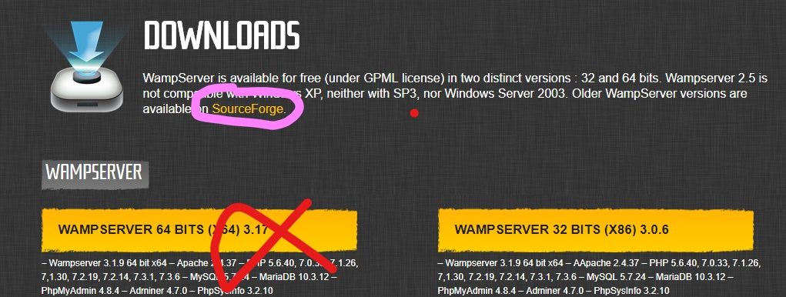
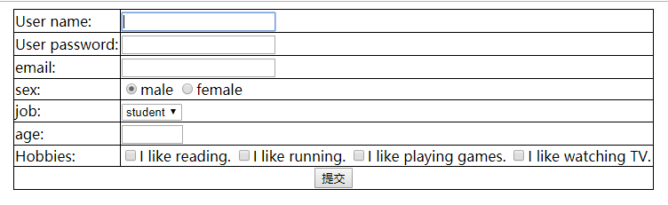
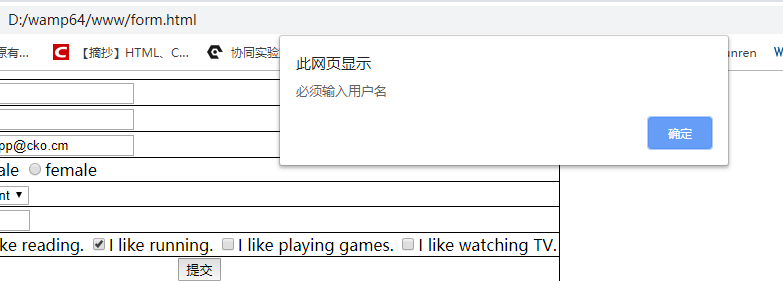
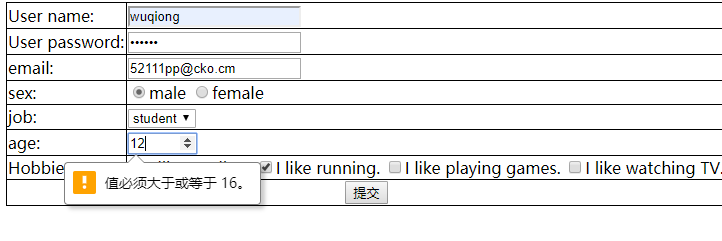
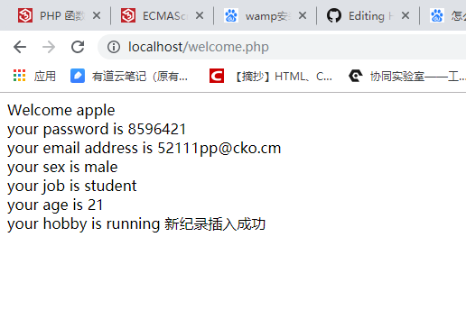
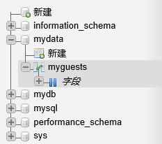
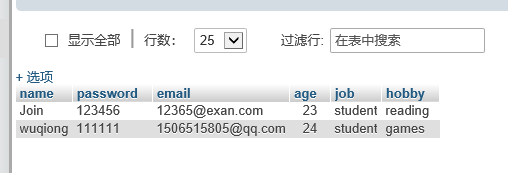

#  web学习阶段任务

 ## 1.安装wamp

* 问题一

  在下载过程中,直接点击主页面的download是不可以下载的，要点击sourceforge，进入后找到3.0.0版本，找到64位进行下载。下载完后按照步骤一步步（next）进行安装。
  
  
  
  

* 配置php，mysql，apache

  * apache

    依次点击W图标—Apache—httpd.conf，找到如图所示的地方，大概在第234行，把“Deny from all”删掉，再把“Allow from 127.0.0.1”改成“Allow from all”，就可以了。

  * php

    PHP的配置比较简单，只需要进行一些基本设置的修改就可以了，依次点击—PHP—php.ini，找到这三个地方：short_open_tag = Off（是否允许使用 PHP 代码开始标志的缩写形式（<? ?> ）。）；

    memory_limit = 128M（最大使用内存的大小）；

    upload_max_filesize = 2M（上传附件的最大值），

    第一个需要改成on，否则的话很多php程序都会运行不了，后面的两项就按照大家的实际需求更改就行了。

  * mysql

    修改密码，创建用户及数据库。

## 2.编写html页面

* 代码

``` html
<!DOCTYPE html>
<html>
<head>
    <meta charset="UTF-8">
    <meta name="viewport" content="width=device-width, initial-scale=1.0">
    <meta http-equiv="X-UA-Compatible" content="ie=edge">
    <title>Document</title>
    <style type="text/css">
      #demo{
          color: red;
      }
      form{
          margin-left:10px;
      }
      table{
          border-collapse: collapse;
        
      }
      table tr td{
          border: solid black 1px;
      }
      table #submit{
         text-align:center;
         width: 30px;
      }
    </style>
        
</head>
<body>
   <form action="http://localhost/welcome.php" method="POST" name="myForm">
       <table>
           <tr>
                <td>User name:</td>
                <td> <input type="text" name="username" required></td> 
           </tr>
            <tr>
                   <td> User password:</td>  
                   <td><input type="password" name="pwd"></td>
            </tr>
            <tr>
                <td>email:</td>
                <td><input type="text" name="email" id="email"></td>
            </tr>
       <tr>
           <td>sex:</td>
           <td><input type="radio" name="sex" value="male" checked>male
            <input type="radio" name="sex" value="female">female</td>
       </tr>
       <tr>
           <td>job:</td>
           <td><select name="job">
                <option value="student">student</option>
                <option value="worker">worker</option>
            </select></td>
       </tr>
        <tr>
               <td>age:</td> <td><input type="number" name="age" min="16" max="100" required></td>
        </tr>
       <tr>
          <td>Hobbies:</td>  
          <td><input type="checkbox" name="hobby[]" value="reading">I like reading.
            <input type="checkbox" name="hobby[]" value="running">I like running.
            <input type="checkbox" name="hobby[]" value="games">I like playing games.
            <input type="checkbox" name="hobby[]" value="TV">I like watching TV.
        </td>
       </tr>
       <tr>
            <td colspan="2" id="submit"><button type="submit" onclick="myFunction()">提交</button></td>
       </tr>
       </table>
        
   </form>
    <p id="demo"></p>
  <script>
   function myFunction() 
   {
       var x,age;
       x=document.forms["myForm"]["username"].value;
       age=document.getElementById("num");
       if(x==''){
            alert("必须输入用户名");
            return false;
       }
       if(age.checkValidity()==false){
           document.getElementById("demo").innerHTML=age.validationMessage;
       }
    }
  </script>

</body>
```

* 图表

  

* js验证

  * 用户名不为空

    

  * 年龄在一定范围内

    

## 3.php获取表单，连接数据库

* 代码

```php
<!DOCTYPE html>
<html lang="en">
<head>
    <meta charset="UTF-8">
    <meta name="viewport" content="width=device-width, initial-scale=1.0">
    <meta http-equiv="X-UA-Compatible" content="ie=edge">
    <title>Document</title>
</head>
<body>
    Welcome <?php echo $_POST["username"]; ?><br>
    your password is <?php echo $_POST["pwd"]; ?><br>
    your email address is  <?php echo $_POST["email"]; ?><br>
    your sex is <?php echo $_POST["sex"]; ?><br>
    your job is <?php echo $_POST["job"]; ?><br>
    your age is <?php echo $_POST["age"]; ?><br>
    your hobby is  <?php
    $result="";
    // foreach($_POST["hobby"] as $i){
    //     $result.=$i;
    // }
    $result=implode(",",$_POST["hobby"]);
    echo $result;
    ?>

<?php
   $link = mysqli_connect('localhost','root','19971120wq','mydata');
    if (!$link) {
     die("Could not connect: ". mysql_connect_error());
 }
//  $sql = "CREATE DATABASE myDB";
//  if (mysqli_query($link, $sql)) {
//      echo "数据库创建成功";
//  } else {
//      echo "Error creating database: " . mysqli_error($link);
//  }

//   $sql="CREATE TABLE IF NOT EXISTS MyGuests(
//       name varchar(30) not null,
//       password varchar(30) noT null,
//       email varchar(50),
//       age int(5),
//       job varchar(15),
//       hobby varchar(50)
//   )";
//   if(mysqli_query($link,$sql)){
//       echo "数据表 MyGuest 成";
//   }else{
//       echo "创建数据表错误: " . mysqli_error($link);
//   }

//   $sql="INSERT INTO MyGuests(name,password,email,age,job,hobby)
//   VALUES('Join','123456','12365@exan.com','23','student','reading')";
//   if(mysqli_query($link,$sql)){
//       echo "新纪录插入成功";
//   }else{
//       echo "Error：" . $sql . "<br>" .mysqli_error($link);
//   }
  $name=$_POST['username'];
  $pwd=$_POST['pwd'];
  $email=$_POST['email'];
  $age=$_POST['age'];
  $job=$_POST['job'];

  $sql="INSERT INTO MyGuests(name,password,email,age,job,hobby)
  VALUES('$name','$pwd','$email',$age,'$job','$result')";
  if(mysqli_query($link,$sql)){
      echo "新纪录插入成功";
  }else{
      echo "Error：" . $sql . "<br>" .mysqli_error($link);
  }
  
  mysqli_close($link);
   ?>


</body>
</html>
```

* 获取结果

  

  

  

  * 连接数据库

    

    

  * 动态获取数据，进行插入

    

  

  

  

  

  

  

  

  
